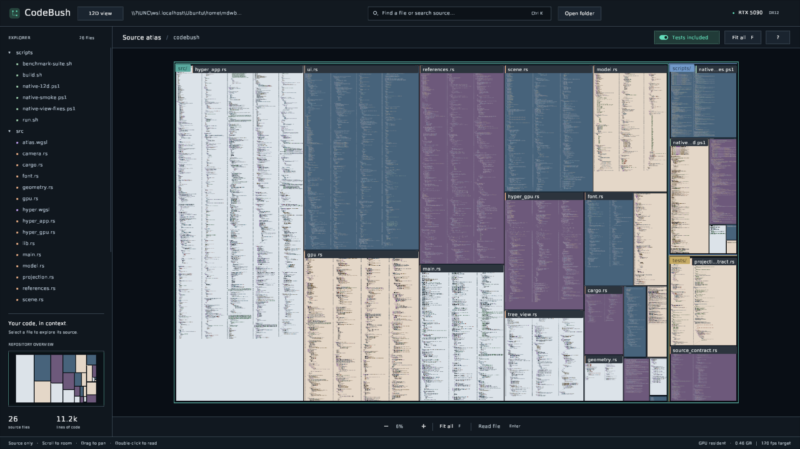
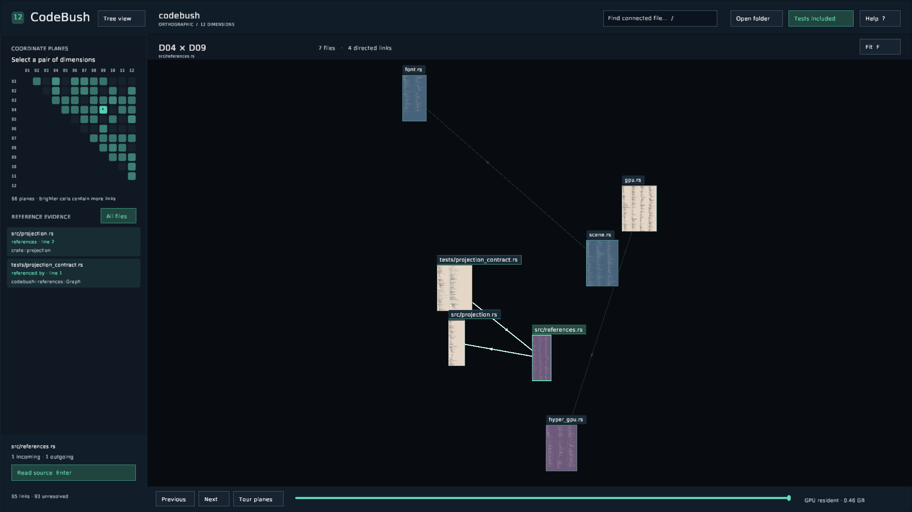

# CodeBush

A native Rust source explorer built for an **RTX 5090** workstation. The default view projects a fixed reference graph in **12 spatial dimensions** onto a 2D canvas. All **66 coordinate planes** are available, with orthogonal rotations, source panels, directed links, and a test toggle. Use the **Tree view / 12D view** button beside the logo to switch instantly in the same window. `--tree` chooses the directory atlas at startup.

Previously named Codetree. Historical validation reports retain that name and their original evidence paths.

```bash
./scripts/run.sh ~/path/to/project --tree
```

The installed Windows executable is `D:\CodeBush\bin\codebush.exe`. Launch it with a source-folder path, use **Open folder**, or drop a folder into the window. The launcher uses native Windows DirectX 12; WSL's software Vulkan adapter is unsuitable. The RTX 5090 is required by default.



**Visual repair passed its fifth and final adversarial review: 8.51/10**, with zero observed rendering errors across 83 offscreen 8K captures and 14 native screenshots. The tree now has dense squarified allocation, contrasting file surfaces, stronger source patterns at overview, and clearer directory groups. The separate 12D view highlights selected connections and supports reading a file and returning to the same graph camera. See [changes, all five verdicts and verification evidence](docs/VISUAL-REPAIR.md).

The original sustained **8K/120fps requirement remains unmet by the measured p99 frame deadlines**, large Rust loading takes approximately 89–91 seconds, and complete direct-reference coverage remains unqualified. The visual pass does not certify those requirements. Earlier [timing results](docs/12D-VALIDATION.md) and [qualification review](docs/12D-CRITIC.md) remain historical evidence.

## Explore a codebase

1. Choose a pair in the triangular dimension matrix. Brighter cells contain more references.
2. Scroll to zoom; drag to pan. Click a connected file, then **Enter / Read source** to read its full text. Read down a column, then continue in the next column when a file has several. Long lines soft-wrap; source is not truncated.
3. Selecting a file highlights its direct links and names their endpoints. The sidebar shows incoming and outgoing references with source-line evidence; click an endpoint or a reference to follow it while keeping the graph framed. **Back to links / Escape** restores your graph camera after reading.
4. Press **T** to include or hide tests. Both views are preloaded.
5. Use **[ / ]** to rotate between planes, **Space** for a continuous tour, or drag the bottom slider to hold an intermediate orientation.

**F** fits the active graph. **Shift-click** cycles overlapping source panels; **O** lists every panel under the pointer in the sidebar. Hover reveals a full path; filenames remain visible when paths are shortened. **/ / Ctrl F** filters connected paths. **Ctrl O** opens a folder, **Ctrl R** reloads, **F11** toggles fullscreen, and **?** opens help.

## Twelve dimensions, two visible axes

Each file has one fixed 12D position. Every resolved directed reference is assigned to exactly one of the 66 planes by a stable hash of its source and target paths. This is the user-approved graph partition: layer membership does not claim that an edge's geometric displacement lies only in its assigned two axes.

A proper orthogonal matrix projects file anchors and reference endpoints onto the screen. Givens rotations preserve 12D lengths, angles, and incidence at every intermediate orientation. Plane weights vary continuously through the rotation. Files without an included incident link are hidden. Source panels are readable screen-facing annotations at the projected anchors.

See [geometry, controls, and resolution boundaries](docs/12D.md) for the equations and exact visibility rule. The renderer uses no perspective camera or intermediate 3D scene. Multiple frames from the supplied concept video were inspected across its timeline.



## Source and reference coverage

Only supported source extensions appear: Rust, Python, JS/TS, C/C++/CUDA, Go, C#, JVM languages, Swift, Ruby, PHP, Lua, shell, shaders, web source, SQL, and other programming languages. Documents, images, binaries, manifests, and the reference video are excluded from the visualizer. Cargo manifests are read only to resolve target roots and test ownership.

The scanner honors ignore rules, skips dependency/build/cache directories and symlinks, and reports read errors. Hidden source directories are supported. Full lines and files are retained; malformed bytes, unavailable Unicode glyphs, and invisible control characters receive explicit escapes. Source files are never rewritten.

Test detection uses file/directory conventions, Cargo test targets, and Rust test attributes. Rust test-only items retain their original line numbering when excluded. Test-only module ancestry also excludes their graph links. Ambiguous conditional code is retained; embedded test expressions in other languages are not removed from production files.

References use static imports, modules, includes, and supported qualified paths. Cargo-declared roots, physical Rust module parents, and recoverable import items in partially unparseable Rust are supported. This is **not compiler-complete analysis**: macro expansion, runtime imports, generated files, external dependencies, build include paths, and some language bindings remain unresolved. Reports separate resolved evidence, unresolved references, parse failures, manifest errors, and unsupported languages. **Tree view** provides access to source without resolved links.

## Residency and loading

Full source glyphs, multiresolution source images, both test modes, 12D positions, plane memberships, and reference edges stay on the GPU. Navigation performs no source reads or source uploads. Near views draw resident glyphs; far views sample images of that same full source. Rotations update small projection uniforms. Switching Tree view / 12D view shares these allocations and preserves each mode’s camera and selection; the tests filter follows you between modes.

The default application allocation cap is **30 decimal GB**, configurable with `--vram-gb` up to **32 GB**. It includes a render-target reserve and fails explicitly if source geometry exceeds the budget. It is an allocation estimate, not an NVML measurement of all driver memory. Source indexing and layout use CPU parallelism. Reloading builds source in the background, then retires the previous source allocations before uploading the replacement, with a loading interface that continues rendering.

## Build and reproduce

On Windows, build with Rust and the Visual Studio C++ build tools, then run the native executable:

```powershell
git clone https://github.com/mdbro/codebush.git
cd codebush
cargo build --locked --release
.\target\release\codebush.exe C:\path\to\project --tree
```

The workstation's WSL launcher cross-compiles with `cargo-xwin`, Clang and LLD, and installs the native Windows executable to `D:\CodeBush\bin`. WSL launching requires Windows interoperability and a mounted D: drive:

```bash
./scripts/build.sh
cargo test --locked --all-targets
./scripts/run.sh ~/path/to/project --capture 'D:\CodeBush\evidence\my-12d-run' \
  --size 7680x4320 --benchmark --benchmark-hz 120 --pipeline-depth 2 --frames 7920
```

The 7,920-frame test traverses all 66 planes with tests off and on, through overview, source-reading, and image/glyph transitions. Captures cover endpoint and intermediate projections, selected overlap, reference evidence, source reading, test filtering, help, and long filenames where a matching fixture exists. `load-report.json`, `dependencies.json`, and `benchmark.json` retain counts, memory, adapter identity, individual timings, and rendering errors. `--manifest FILE` exports the exact indexed source list.

For the current native navigation checks, run `scripts/native-view-fixes.ps1` in Windows PowerShell with `-Executable`, `-Source`, `-Output` and optionally `-TreeStart`. It checks foreground ownership before input and verifies search traversal, mode changes, test filtering, same-card reading selection, reference following, graph-camera restoration, rotations and resizing. The separate `scripts/native-12d.ps1` covers overlap candidates and optional reload/open flows. `--native-timing FILE` records frame intervals on exit; **F12** writes an adjacent interaction-state snapshot when that option is enabled.

GPU timestamps measure execution; completion and deadline timings include submission and scheduling. The deadline gate is p99 ≤ 8.333 ms with zero GPU validation errors. Average cadence alone is not a pass. The attached desktop is 4K at approximately 60 Hz, so offscreen 8K results do not certify physical 8K/120 presentation.

On the original workstation, the source lives at `~/codebush`; `~/codetree` is a compatibility alias. The local `target` symlink and Windows toolchain caches reuse storage under `D:\Codetree`, while new executables and evidence use `D:\CodeBush`. Build artifacts, local evidence, and the supplied reference video are excluded from the repository. Historical reports reference local evidence that is not included in a clone.

Libraries include [wgpu 29](https://docs.rs/wgpu/29.0.4/wgpu/), [winit](https://docs.rs/winit/0.30.13/winit/), [syn](https://docs.rs/syn/), and [fontdue](https://docs.rs/fontdue/0.9.4/fontdue/). Font attribution is in `assets/FONT-LICENSE.txt`.
